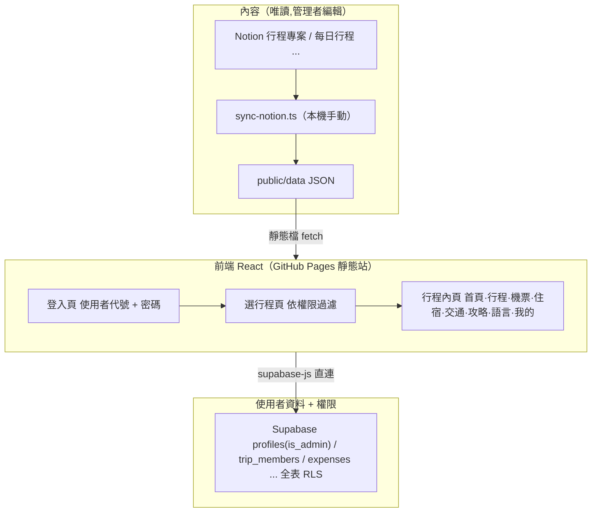
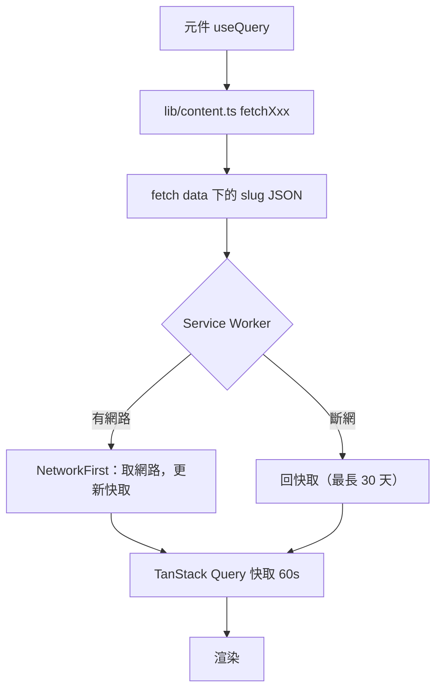
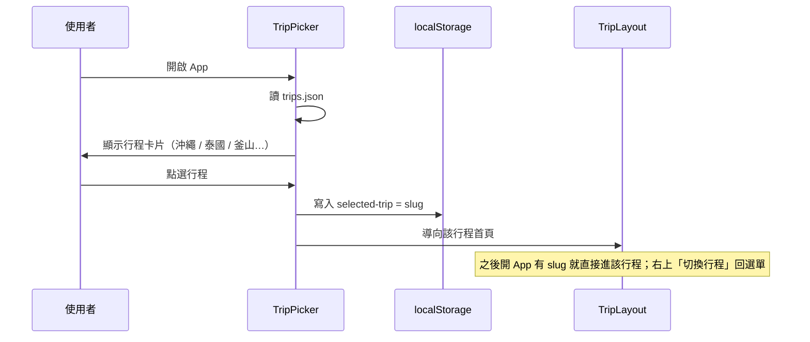
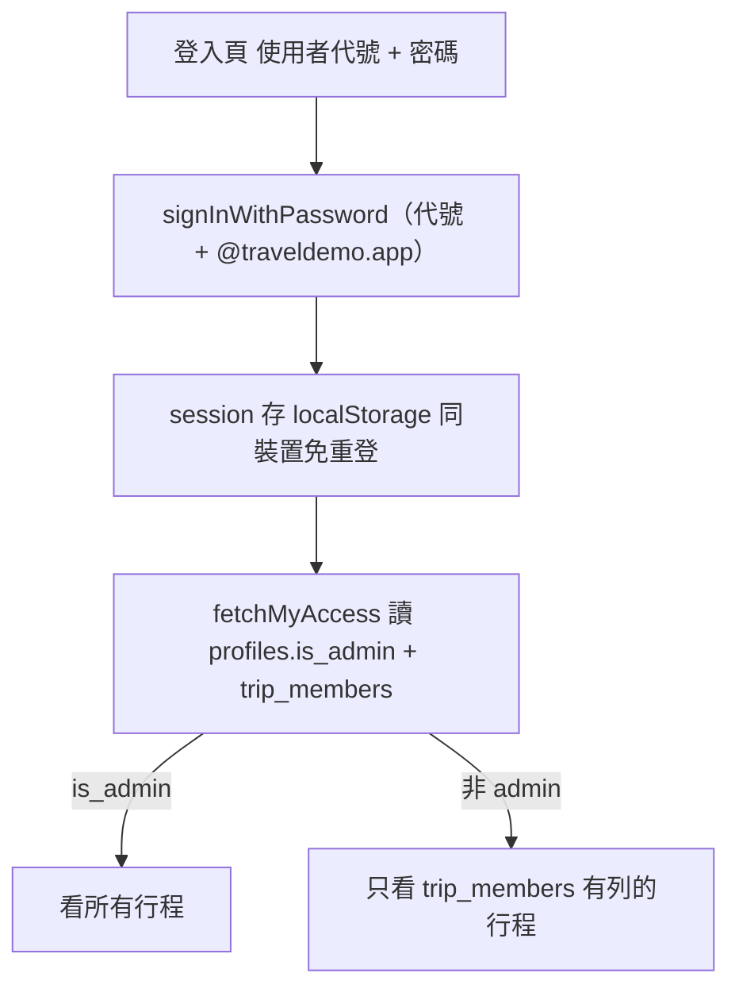
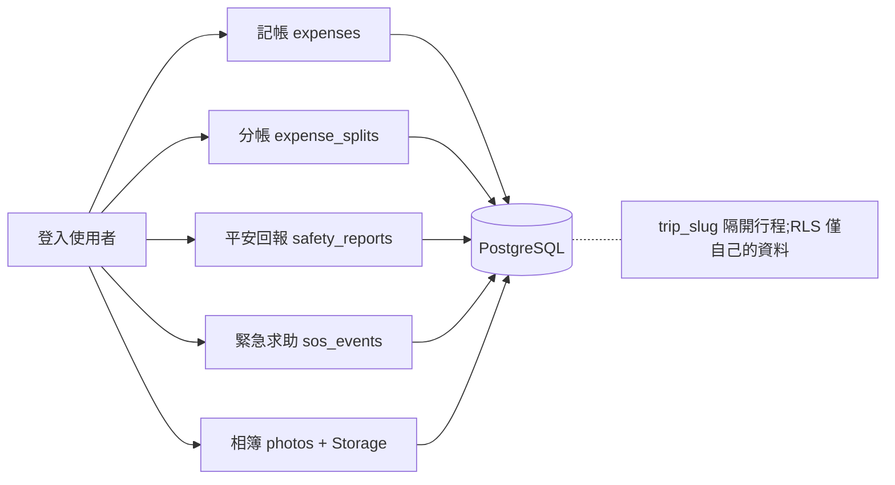
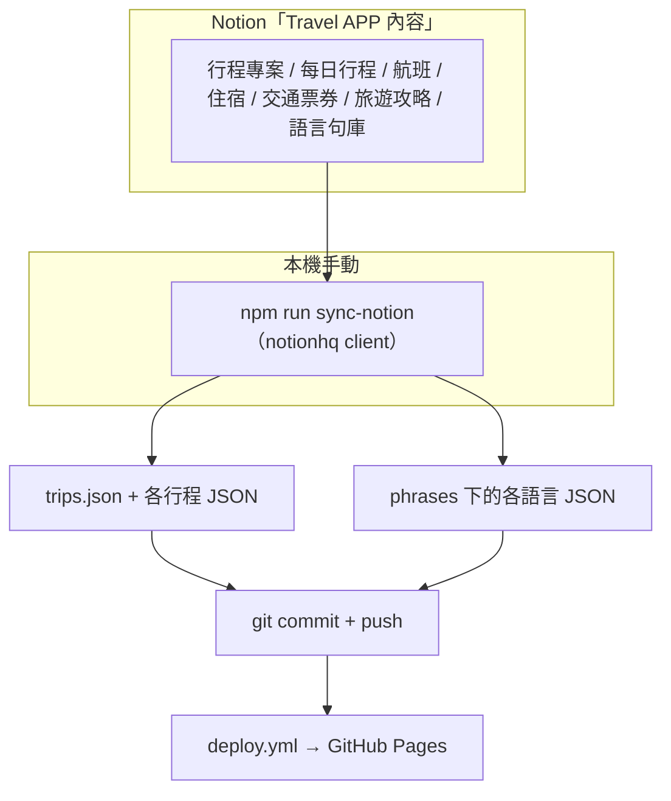
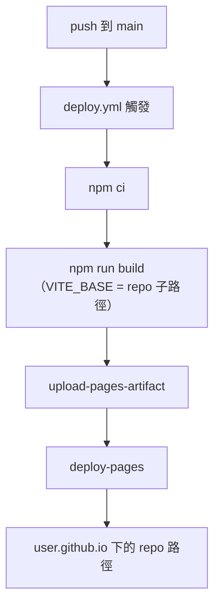

# Travel APP 專案文件

## 專案概述

### 專案名稱
**Travel APP** — 旅遊行程 Web / PWA

### 專案用途
- 多專案切換（第一頁選行程：沖繩 / 泰國 / 釜山…），進入後看該行程內容
- 每日行程瀏覽（逐時段、分類標記、Google 地圖連結、票券徽章）
- 機票 / 住宿 / 交通票券（如釜山 PASS）/ 乘車紀錄
- 旅遊攻略（簽證 / 入境 / 電壓 / 退稅 / 緊急聯絡）與語言小卡句庫（依語言共用）
- 帳號登入（使用者代號 + 密碼，Supabase Auth）；由管理者設定誰能看哪些行程
- 使用者功能（規劃中）：記帳、分帳、平安回報、相簿上傳
- 離線可用（PWA，加入主畫面），出國斷網仍可看已快取內容
- 內容以 Notion 為後台，本機 `npm run sync:notion` 產生靜態 JSON 後 commit

---

## 技術架構

### 開發環境
- **建置工具**：Vite 5
- **框架**：React 18 + TypeScript
- **路由**：React Router 6（`HashRouter`）
- **資料抓取**：TanStack Query 5
- **PWA**：vite-plugin-pwa 0.20
- **使用者資料**：Supabase（PostgreSQL 17 + Auth + Storage）
- **內容後台**：Notion（`@notionhq/client`，僅同步腳本使用）
- **Node**：20+（開發機實測 v24）

### 系統架構



---

## 核心結構

### 前端頁面模組

| 路由 | 元件 | 說明 |
|------|------|------|
| `/login` | `Login` | 使用者代號 + 密碼（已啟用帳號功能時,未登入一律導到這） |
| `/` `/pick` | `TripPicker` | 依權限顯示行程,分「旅程中 / 即將開始 / 已結束」三段;選行程後存 `localStorage` |
| `/t/:slug` | `TripLayout` | 底部分頁殼、右上「切換行程」;未授權的 slug 導回 `/pick` |
| `/t/:slug/home` | `Home` | 當地 / 台北雙時鐘、今日行程、工具卡 |
| `/t/:slug/itinerary` | `Itinerary` | 每日行程，類型圖示 + Google 地圖連結 + 票券徽章 |
| `/t/:slug/flights` | `Flights` | 去 / 回程航班 |
| `/t/:slug/hotels` | `Hotels` | 住宿（入住 / 退房 / 地圖） |
| `/t/:slug/transport` | `Transport` | 票券、乘車紀錄、連結 |
| `/t/:slug/guide` | `Guide` | 旅遊攻略分節 |
| `/t/:slug/phrases` | `Phrases` | 語言小卡句庫（依 `trip.lang` 共用） |
| `/t/:slug/mine` | `Mine` | 「我的」:代號卡 + 功能列 + 登出 |

### 內容讀取流程



---

## 功能模組詳解

### 1. 多專案選擇



- 每個行程一個 `slug`（如 `busan-2026`），對應 `public/data/<slug>/` 與 Supabase 的 `trip_slug`。
- 離線時 `trips.json` 與「選過的行程」JSON 皆已被 Service Worker 快取。

### 2. 每日行程

- 資料：`public/data/<slug>/itinerary.json`，`days[].items[]`。
- `type`：`transport` / `food` / `sightseeing` / `activity` / `shopping` / `hotel` / `note`，各有 emoji 圖示。
- `pass`：使用的票券名稱，顯示為徽章。
- `mapUrl`：Google 地圖連結，顯示「📍 在 Google 地圖開啟」。
- `Home` 的「今日行程」以今天日期比對 `days[].date`，找不到則顯示第 1 天。

### 3. 機票 / 住宿 / 交通 / 攻略 / 語言

| 頁面 | 資料檔 | 重點 |
|------|--------|------|
| 機票 | `flights.json` | 去 / 回程，`departLocal` / `arriveLocal` 用當地時間字串 |
| 住宿 | `hotels.json` | 入住 / 退房 / 晚數 / 地圖連結 |
| 交通 | `transport.json` | `passes`（票券）、`rides`（乘車）、`links` |
| 攻略 | `guide.json` | `sections[]` 分節條列 |
| 語言 | `phrases/<lang>.json` | 依 `trip.lang` 共用；`categories[].phrases[]`：中文 / 目標語 / 拼音 |

### 4. 帳號登入與行程權限



- 登入用**使用者代號**,不用 Email(`src/lib/config.ts` 做代號 ↔ email 轉換)。
- 建帳號:Supabase → SQL Editor → `select public.create_app_user('代號','密碼');`
- 權限:`profiles.is_admin` 看全部 / `trip_members` 逐列指定。`TripPicker` 與 `TripLayout` **等權限回來才渲染**,未授權網址導回 `/pick`。
- **限制**:內容 JSON 是公開靜態檔,此為 UI 層控管。詳見 `doc/Database.md`。

### 5. 使用者資料功能（Supabase,規劃中）



表已就緒,前端待做。詳見 `doc/Database.md`。

---

## 內容同步架構（Notion → JSON）



> Actions 版的 `sync-notion.yml` 已移除,改由本機手動同步(見 `doc/Issue.md` 項次 005)。

- 前端**不直接呼叫 Notion API**（CORS + token 為機密），一律經 JSON。
- 「時區JSON」欄位為 `label|tz;label|tz` 純文字，由同步腳本解析。
- 內容（行程 / 航班 / 住宿 / 交通 / 攻略）依 `slug` 綁行程；語言句庫依 `lang`（`ko` / `ja` / `th` / `en`）共用。
- Notion 屬性 ↔ JSON 欄位對照見 `doc/Notion.md`。

---

## 資料庫（Supabase）

- 專案 region：`ap-northeast-2`（首爾）。
- 表：`profiles`(含 `is_admin`)、`trip_members`、`expenses`、`expense_splits`、`safety_reports`、`sos_events`、`photos`、`packing_checks`、`message_receipts`。
- 全表啟用 RLS，政策一律「只能存取自己的資料」（`user_id = auth.uid()`；`profiles` 用 `id`；`expense_splits` 用 `owner_user_id`）。
- 以 `trip_slug` 欄位隔開不同行程的個人資料。
- 帳號:`auth.users`(用代號 + `@traveldemo.app`);建帳號用 `public.create_app_user()`。
- 完整欄位、帳號 / 權限說明與 migration 紀錄見 `doc/Database.md`。

---

## 部署（GitHub Pages）



設定步驟：
1. Repo Settings → Pages → Source 選 **GitHub Actions**。
2. （可選）Repo Settings → Secrets 加 `VITE_SUPABASE_URL`、`VITE_SUPABASE_ANON_KEY`。
3. push 到 `main` 即自動 build 部署。

> repo 需為 **Public**（免費帳號的 Pages 限制）。
> 內容同步是**本機手動**：`npm run sync:notion` 更新 `public/data/` → commit → push（見 `doc/Issue.md` 項次 005）。

---

## 開發環境設定

### 必要軟體
1. **Node.js 20+**（開發機實測 v24.19.0）
2. **Git** 2.30+
3. 現代瀏覽器（Chrome / Edge / Safari）

### 安裝與啟動

```bash
npm install
cp .env.example .env      # 填 Supabase anon key（不填則帳號功能停用,內容照常）
npm run dev               # http://localhost:5173
```

### 其他指令

```bash
npm run build             # tsc -b && vite build → dist/
npm run preview           # 本機預覽 dist/
npm run sync:notion       # 從 Notion 同步內容到 public/data/
```

---

## 目錄結構

```
Travel APP/
├── index.html
├── vite.config.ts               # base / PWA / runtimeCaching
├── package.json                 # dev / build / preview / sync:notion
├── .env.example
├── src/
│   ├── main.tsx                 # HashRouter + AuthProvider + RequireAuth 守衛
│   ├── types.ts
│   ├── lib/                     # content.ts / supabase.ts / auth.tsx / members.ts / config.ts / trip.ts
│   └── pages/                   # Login / TripPicker / TripLayout / Home / ... / Mine
├── public/
│   ├── favicon.svg
│   └── data/                    # trips.json + <slug>/*.json + phrases/<lang>.json
├── scripts/sync-notion.ts
├── examples/                    # 內容 JSON 範本 + schema 說明
├── .github/workflows/deploy.yml # 唯一 workflow
└── doc/                        # Issue.md / Database.md / Notion.md / secrets.local.md（不進版控）
```

### 關鍵檔案

| 檔案 | 說明 |
|------|------|
| `src/main.tsx` | 路由 + Provider + `RequireAuth`（未登入導 `/login`） |
| `src/lib/auth.tsx` | `AuthProvider` / `useAuth`(session、登入、登出) |
| `src/lib/members.ts` | `fetchMyAccess()`：`is_admin` + `trip_members` |
| `src/lib/config.ts` | 使用者代號 ↔ Auth email 轉換 |
| `src/lib/content.ts` | 內容 JSON 讀取（所有頁面共用） |
| `src/lib/supabase.ts` | Supabase client（無金鑰時優雅停用；`persistSession`） |
| `scripts/sync-notion.ts` | Notion → `public/data` 同步（**本機手動**跑） |
| `.github/workflows/deploy.yml` | GitHub Pages 部署（唯一的 workflow） |

---

## 文件維護

| 項目 | 內容 |
|------|------|
| 專案 | Travel APP（旅遊網頁 / APP） |
| 建立日期 | 2026-09-04 |
| 最後更新 | 2026-09-04（加入帳號登入與行程權限,見 `doc/Issue.md` 項次 006） |
| 文件版本 | v1.1 |

相關文件：
- `doc/Issue.md` — 問題與決策紀錄（append-only 項次制）
- `doc/Database.md` — Supabase 表結構
- `doc/Notion.md` — Notion 內容後台結構
- `CLAUDE.md` — 開發指引與慣例
- `examples/README.md` — 內容 JSON schema 說明
